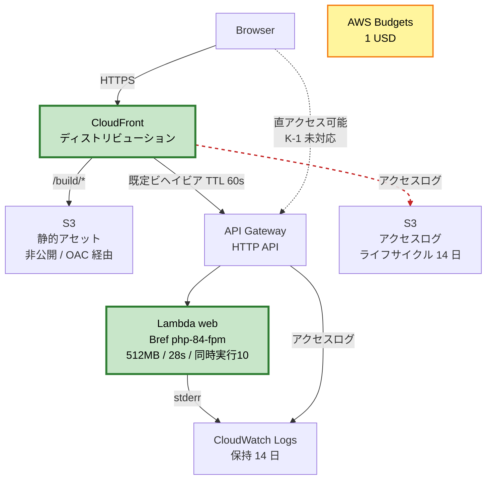

# Deployment Architecture — UoW-1（基盤構築）

**リージョン**: `ap-northeast-1`
**ステージ**: `prod` のみ（Q3 = A）
**スタック名**: `hk-portfolio-prod`

---

## 1. デプロイ構成



**テキスト代替**

```
Browser --HTTPS--> CloudFront
                     |-- /build/*        --> S3（静的アセット、非公開、OAC 経由）
                     |-- 既定（TTL 60秒） --> API Gateway HTTP API --> Lambda(web)
                     |-- アクセスログ      --> S3（ライフサイクル 14 日）

Lambda      --stderr--> CloudWatch Logs（保持 14 日）
API Gateway --ログ-----> CloudWatch Logs（保持 14 日）
AWS Budgets（1 USD）でアカウント全体の費用を監視

【既知の未対応 K-1】
Browser --直アクセス--> API Gateway（CloudFront を迂回できる）
  → 費用は Lambda の予約済み同時実行数 10 で頭打ち
  → 構成図の拡張ポイントに図示する
```

---

## 2. 認証情報

**方式**: IAM Identity Center（SSO）の一時認証情報（Q4 = B）。**準備済み**。
セッション開始時に環境変数へ export して使う。

```bash
# 例: SSO でログインし、認証情報を環境変数に展開してから osls を実行する
aws sso login --profile <profile>
export AWS_PROFILE=<profile>
export AWS_REGION=ap-northeast-1
```

**CON-1 は解消**: これにより Bolt B-2 の前提条件が満たされる。

**方針**: 長期のアクセスキーをローカルに保存しない（SECURITY-12）。
`.env` や `serverless.yml` に認証情報を書かない。

---

## 3. デプロイ手順（Bolt B-2）

```bash
# 1. フロントエンドのビルド
./vendor/bin/sail npm run build

# 2. 依存の脆弱性チェック（NFR-S5 / SECURITY-10）
./vendor/bin/sail composer audit
./vendor/bin/sail npm audit

# 3. 本番用の依存に絞る（開発用パッケージを含めない）
#    ※ 具体的な手順は Code Generation で確定する

# 4. デプロイ
osls deploy --stage prod
```

**初回デプロイの注意**

| 項目 | 内容 |
|---|---|
| 所要時間 | **CloudFront ディストリビューションの作成に 10〜20 分**かかる。2 回目以降は数分 |
| 出力 | デプロイ完了時に CloudFront のドメイン名（`dxxxxxxxx.cloudfront.net`）が表示される。これが公開 URL（NFR-5） |
| 予算通知 | `BUDGET_ALERT_EMAIL` 環境変数が必要。未設定だとデプロイが失敗する |
| 権限不足 | Q6 = B の方針により、初回は権限不足のエラーを見ながらデプロイ用ポリシーを詰める |

---

## 4. デプロイ後の検証（B-2 の完了判定）

| # | 検証項目 | 方法 | 対応要件 |
|---|---|---|---|
| V-1 | 公開 URL にアクセスできる | ブラウザで CloudFront ドメインを開く | 完了条件 |
| V-2 | セキュリティヘッダが付いている | `curl -I https://dxxxx.cloudfront.net` で 5 ヘッダを確認 | NFR-S1 |
| V-3 | HTTP が HTTPS にリダイレクトされる | `curl -I http://dxxxx.cloudfront.net` | SECURITY-01 |
| V-4 | 静的アセットが S3 から配信される | レスポンスヘッダの `X-Cache` と `Cache-Control` を確認 | U1-PF-3 |
| V-5 | HTML が 60 秒キャッシュされる | 連続アクセスで `X-Cache: Hit from cloudfront` を確認 | U1-PF-4 |
| V-6 | S3 バケットが直接アクセスできない | バケットの URL に直接アクセスして 403 を確認 | NFR-S7 |
| V-7 | アプリケーションログが JSON で出ている | CloudWatch Logs を確認 | U1-OB-1 |
| V-8 | ロググループの保持が 14 日 | CloudWatch Logs の設定を確認 | ADR-014 |
| V-9 | CloudFront のアクセスログが S3 に出ている | ログバケットを確認（**配信まで最大 1 時間程度かかる**） | NFR-S2 |
| V-10 | エラーページに内部情報が出ない | 存在しないパスにアクセスして表示内容を確認 | NFR-S6 |

**V-2 の注意**: ヘッダはアプリ側で付与するため（ADR-015）、
CloudFront 経由でも API Gateway 直でも同じヘッダが返るはず。両方で確認する。

---

## 5. ロールバック手順

| 状況 | 手順 |
|---|---|
| デプロイ後に不具合が判明した | 直前のコミットに戻して `osls deploy --stage prod` を再実行する |
| デプロイ自体が失敗した | CloudFormation が自動でロールバックする。スタックが `ROLLBACK_COMPLETE` で止まった場合は削除して再作成 |
| 全て削除したい | `osls remove --stage prod` |

**前提**: 永続データを持たないため、ロールバックによって失われるものが無い（U1-AV-2, U1-AV-3）。
これは ADR-002（データベースを持たない）の副次的な利点。

**注意**: `osls remove` は CloudFront ディストリビューションの削除に時間がかかる。
また、S3 バケットにオブジェクトが残っていると削除に失敗することがある。

---

## 6. 未確定事項（Code Generation で確定する）

| # | 内容 |
|---|---|
| D-1 | Lift の `extensions` が期待どおり `DistributionConfig.Logging` をマージするか（実機確認） |
| D-2 | `bref/laravel-bridge` が `/tmp` 関連の設定をどこまで自動処理するか |
| D-3 | 本番デプロイ時に開発用依存を除外する具体的な手順 |
| D-4 | デプロイ用 IAM ポリシーの最終的な内容（初回デプロイで詰める） |
| D-5 | `BUDGET_ALERT_EMAIL` に使うメールアドレス |
