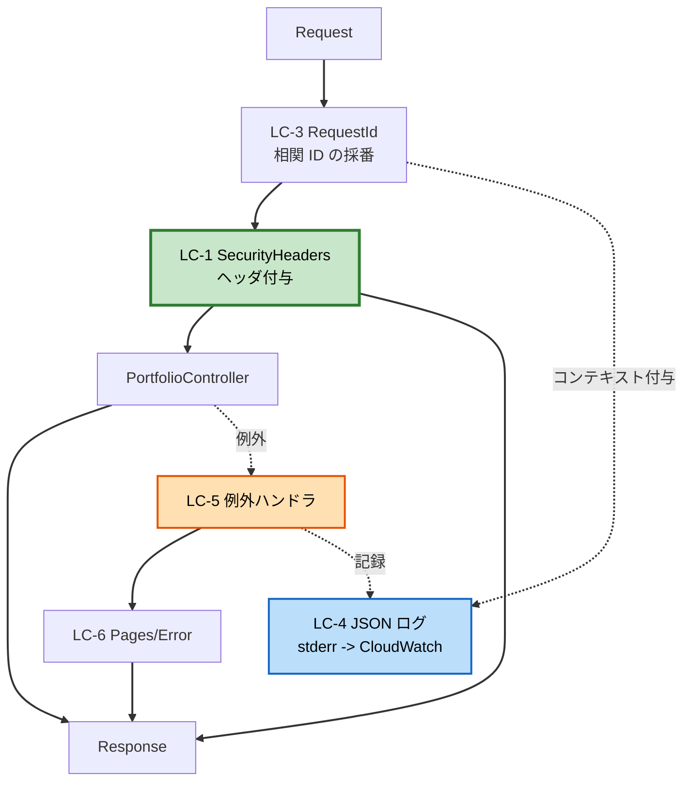

# Logical Components — UoW-1（基盤構築）

NFR を満たすために追加される論理コンポーネントと、その統合方法。

---

## 1. コンポーネント一覧

| # | コンポーネント | 種別 | 対応パターン | 対応要件 |
|---|---|---|---|---|
| LC-1 | `SecurityHeaders` | Laravel ミドルウェア | P-1 | NFR-S1 / U1-SE-1 |
| LC-2 | `config/security.php` | 設定 | P-1 | NFR-S1 |
| LC-3 | `RequestId` | Laravel ミドルウェア | P-4 | U1-OB-2 |
| LC-4 | `config/logging.php`（JSON チャンネル） | 設定 | P-4 | U1-OB-1 |
| LC-5 | 例外ハンドラ（`bootstrap/app.php`） | フレームワーク設定 | P-5 | U1-RL-1, U1-RL-2 |
| LC-6 | `Pages/Error` | React コンポーネント | P-5 | U1-RL-2 |
| LC-7 | CloudFront ビヘイビア（HTML / アセット） | インフラ | P-2 | U1-PF-3, U1-PF-4 |
| LC-8 | Lambda 予約済み同時実行 | インフラ | P-3 | U1-SC-2 |
| LC-9 | AWS Budgets | インフラ | P-3 | U1-RL-4 |
| LC-10 | ロググループ保持設定 + S3 ライフサイクル | インフラ | — | U1-OB-4, U1-OB-8 |

LC-7 〜 LC-10 の具体的な記述（`serverless.yml`）は **Infrastructure Design** で確定する。
本書ではその責務と設定値のみを定める。

---

## 2. アプリケーション層のコンポーネント

### LC-1: `SecurityHeaders`（ミドルウェア）

**責務**: `config/security.php` に定義されたヘッダをレスポンスに適用する。

**統合位置**: `web` ミドルウェアグループの先頭付近。
Inertia のミドルウェアより前でも後でも結果は変わらないが、
「レスポンスを加工する」性質のため後段に置く。

**擬似コード**

```php
public function handle(Request $request, Closure $next): Response
{
    $response = $next($request);

    foreach ($this->headers as $name => $value) {
        $response->headers->set($name, $value);
    }

    return $response;
}
```

**設計判断**: ヘッダ値を設定に外出しし、ミドルウェアは適用のみを担う。
Feature テストが `config('security.headers')` と実レスポンスを突き合わせられるため、
「設定を変えたのにテストが通ってしまう」状態を避けられる。

### LC-2: `config/security.php`

```php
return [
    'headers' => [
        'Content-Security-Policy' => implode('; ', [
            "default-src 'self'",
            "script-src 'self'",
            "style-src 'self' 'unsafe-inline'",   // ADR-011
            "img-src 'self' data:",
            "font-src 'self'",
            "connect-src 'self'",
            "frame-ancestors 'none'",
            "base-uri 'self'",
            "form-action 'none'",
        ]),
        'Strict-Transport-Security' => 'max-age=31536000; includeSubDomains',
        'X-Content-Type-Options' => 'nosniff',
        'X-Frame-Options' => 'DENY',
        'Referrer-Policy' => 'strict-origin-when-cross-origin',
    ],
];
```

**注意**: `Strict-Transport-Security` はローカル（HTTP）では意味を持たないが、
ブラウザが無視するだけで害はないため、環境で分岐させない。

### LC-3: `RequestId`（ミドルウェア）

**責務**: 相関 ID を採番し、ログコンテキストに設定する。

**取得順序**
1. Lambda のリクエスト ID（Bref のコンテキストから取得。本番）
2. 取得できない場合は UUID を生成（ローカル・テスト）

**擬似コード**

```php
public function handle(Request $request, Closure $next): Response
{
    $requestId = $this->lambdaRequestId() ?? (string) Str::uuid();

    Log::withContext(['request_id' => $requestId]);

    return $next($request);
}
```

**設計判断**: Q5 = A（Lambda リクエスト ID）を基本としつつ、
取得できない環境ではフォールバックする。
これにより本番では CloudWatch の REPORT 行と突き合わせでき、
ローカルでも 1 リクエスト内のログを相関できる。

**セキュリティ**: リクエスト ID 以外のリクエスト情報（ヘッダ・クッキー）を
自動でログに載せない（SECURITY-03）。

### LC-4: ログチャンネル

```php
'stderr' => [
    'driver' => 'monolog',
    'handler' => StreamHandler::class,
    'with' => ['stream' => 'php://stderr'],
    'formatter' => JsonFormatter::class,
    'level' => env('LOG_LEVEL', 'info'),
],
```

- 本番・ローカルとも `stderr` を既定チャンネルにする（P-6）
- ファイルへの書き込みを行わない（Lambda では `storage/logs` に書けない）

### LC-5: 例外ハンドラ

**責務**
1. 未捕捉例外を構造化ログに記録する（スタックトレース込み）
2. 本番では固定文言のエラーページを返す

**擬似コード**（`bootstrap/app.php`）

```php
->withExceptions(function (Exceptions $exceptions) {
    $exceptions->respond(function (Response $response, Throwable $e, Request $request) {
        if (app()->environment('local')) {
            return $response;   // 既定のデバッグ画面
        }

        return Inertia::render('Error', [
            'status' => $response->getStatusCode(),
        ])->toResponse($request)->setStatusCode($response->getStatusCode());
    });
})
```

**フェイルクローズ**: 例外発生時に部分的な内容を推測して返さない。
エラーページのみを返す。

### LC-6: `Pages/Error`（React）

**責務**: ステータスコードに応じた固定文言を表示する。

| ステータス | 表示 |
|---|---|
| 404 | ページが見つかりません |
| 429 | アクセスが集中しています（Q4 = A のため CloudFront 側では何もしない。Lambda に到達した場合のみ） |
| 500 | エラーが発生しました |
| その他 | エラーが発生しました |

**表示しないもの**: 例外メッセージ、スタックトレース、ファイルパス、
フレームワークのバージョン（SECURITY-09）。

---

## 3. インフラ層のコンポーネント（Infrastructure Design で具体化）

### LC-7: CloudFront ビヘイビア

| パスパターン | オリジン | TTL | Cache-Control |
|---|---|---|---|
| `/build/*` | S3 | 1 年 | `public, max-age=31536000, immutable` |
| `/*`（既定） | API Gateway | 60 秒 | `public, max-age=60` |

**注意**: `Cache-Control` はアプリケーション側（レスポンスヘッダ）で指定し、
CloudFront はそれに従う構成を基本とする。
Lift の設定可能範囲は Infrastructure Design で確認する（K-3）。

### LC-8: Lambda 予約済み同時実行

| 項目 | 値 |
|---|---|
| 予約済み同時実行数 | **10** |
| 上限到達時の応答 | 429（カスタム処理なし。Q4 = A） |

**調整方針**: 実運用で 429 が観測されたら引き上げる。
引き上げの判断材料は CloudWatch の `Throttles` メトリクス。

### LC-9: AWS Budgets

| 項目 | 値 |
|---|---|
| 予算 | 月 1 USD |
| 通知 | 実績が 80% / 100% に到達した時点でメール |
| 費用 | 2 予算まで無料 |

### LC-10: ログ保持設定

| 対象 | 保持期間 | 実現方法 |
|---|---|---|
| Lambda ロググループ | 14 日 | `serverless.yml` の `logRetentionInDays` |
| CloudFront アクセスログ（S3） | 14 日 | S3 ライフサイクルルール |
| API Gateway アクセスログ | 14 日 | ロググループの保持設定 |

根拠は ADR-014（SECURITY-14 のログ保持要件は適用外）。

---

## 4. 統合図



**テキスト代替**

```
Request
  -> LC-3 RequestId（相関 ID を採番し、ログコンテキストに設定）
  -> LC-1 SecurityHeaders（後続処理の後、レスポンスにヘッダを付与）
  -> PortfolioController
       正常時 -> Response
       例外時 -> LC-5 例外ハンドラ
                  -> 構造化ログに記録（LC-4）
                  -> LC-6 Pages/Error をレンダリング
                  -> Response（ヘッダは LC-1 が付与済み）
```

**重要**: 例外経路でも `SecurityHeaders` を通るため、エラーページにもヘッダが付く。
ミドルウェアの順序として `SecurityHeaders` を外側に置くことで担保する。

---

## 5. 設定値の一覧（Infrastructure Design への引き渡し）

| 項目 | 値 | 出所 |
|---|---|---|
| リージョン | `ap-northeast-1` | Q1 |
| Lambda メモリ | 512 MB | Q5 |
| Lambda タイムアウト | 28 秒 | U1-PF-2 |
| 予約済み同時実行数 | 10 | ADR-013 |
| HTML の TTL | 60 秒 | Q2 = B |
| 静的アセットの TTL | 1 年 | P-2 |
| ログ保持期間 | 14 日 | ADR-014 |
| 予算アラート | 1 USD | ADR-013 |
| PHP ランタイム | `php-84-fpm` | ADR-007 |
| キャッシュストア出力先 | `/tmp` | P-6 |
