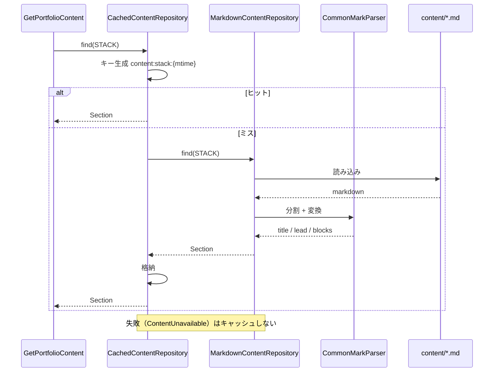

# Business Logic Model — UoW-2（コンテンツ基盤）

処理の流れ、変換アルゴリズム、props への写像。
規則そのものは [business-rules.md](business-rules.md)、モデルは [domain-entities.md](domain-entities.md)。

---

## 1. このユニットが持つロジックの全体量

**「Markdown を読んで H2 で切り、HTML に変換する」以外に何もしない。**

判定・計算・状態遷移・永続化はいずれも存在しない。
ロジックと呼べるものは次の 3 つに尽きる。

| # | ロジック | 複雑さ |
|---|---|---|
| L-1 | Markdown を `title` / `lead` / `blocks` に分割する | 中（見出しの走査） |
| L-2 | 見出しを照合用キーに正規化する | 小（文字列変換 3 手順） |
| L-3 | 失敗を「表示できる失敗」に変換する | 小（例外の捕捉と差し替え） |

**この薄さ自体が ADR-004 の裏付けになる。**

---

## 2. L-1: 分割アルゴリズム

CommonMark のパーサが作る文書ツリーを、先頭から 1 回だけ走査する。

```
title  <- null
lead   <- []          （HTML 断片の並び）
blocks <- []
current <- null       （組み立て中の ContentBlock）

各ノード n について:
    n が H1 かつ title が未設定 なら:
        title <- n のテキスト
        （n 自体はどこにも積まない = HTML から除去。R-1 / Q3 = A）

    そうでなく n が H2 なら:
        current があれば blocks に確定して積む
        current <- 新しいブロック（heading = n のテキスト、
                                   key = 正規化(n のテキスト)、
                                   html = []）

    そうでなければ:
        current があれば current.html に積む
        なければ lead に積む

最後に current があれば blocks に積む
```

**性質**

| 性質 | 説明 |
|---|---|
| 単一走査 | 文書を 1 回なめるだけ。入れ子の再帰は CommonMark 側に任せる |
| 順序保存 | H2 の出現順がそのまま `blocks` の順になる（R-5-2） |
| 破壊しない | 認識できない要素は「今いる場所」にそのまま積む。捨てない |

**H2 が無い場合**（`experience.md` / `next.md`）
`current` が最後まで `null` のままなので、全ての本文が `lead` に入り
`blocks` は空配列になる。**これは正常系**（R-1-4）。

---

## 3. L-2: 正規化

規則は R-2。実装は「前後空白の除去 → 連続空白の畳み込み → ASCII 小文字化」の 3 手順。

**サーバとフロントの両方に同じ実装が必要**という構造上の弱点がある。
R-2 の「重大な注意」と、UoW-4 での緩和策 3 点を必ず参照すること。

---

## 4. L-3: 失敗の変換

```
ユースケース: 全セクションを取得する
    結果 <- []
    SectionId の各ケース（表示順）について:
        試みる:
            section <- リポジトリから取得
        失敗した場合（ContentUnavailable）:
            ログに記録（セクション ID、理由の種別、例外クラス名）
            section <- Section::failed(そのID)
        結果に section を積む
    PortfolioContent(結果) を返す
```

**設計上の要点**

| # | 内容 |
|---|---|
| 1 | 取得層は失敗を隠さず例外を投げる。**「どう見せるか」は決めない** |
| 2 | 見せ方を決めるのはユースケース層。表示方針が変わっても取得層を触らずに済む |
| 3 | 例外は外に出さない。**1 セクションの失敗でページ全体が落ちない**（Q6 = B） |
| 4 | 結果の要素数は常に 4。セクションが消えることはない |

---

## 5. キャッシュの流れと、粒度の判断

### 判断: セクション単位（Q7 = A）を採用する

Q7 の回答は「A。ただし、API で一括してページ全体を取っているのであれば C でも可」でした。
**条件は満たされています**（単一ページ構成のため、`GetPortfolioContent` が 1 回の
リクエストで 4 セクションをまとめて組み立てる）。そのうえで **A を選びました。**

**理由**

| # | 理由 |
|---|---|
| 1 | **失敗をキャッシュしない規則（R-6-3）と噛み合う。** ページ全体を 1 つのキーにすると、1 セクションの失敗が混ざった結果をキャッシュするか、全体をキャッシュしないかの二択になる |
| 2 | ページ全体のキーには 4 ファイル分の更新時刻が必要で、キーの組み立てが複雑になる |
| 3 | **承認済みの Application Design（ポートに対するデコレータ）をそのまま保てる。** ページ全体をキャッシュするなら、キャッシュの責務がユースケース層に移り、層の設計が変わる |
| 4 | 得られるのはキャッシュ読み取り 4 回 → 1 回の削減のみ。`/tmp` 上のファイルキャッシュでは体感差が出ない |

**C に切り替えるべき状況**: セクション数が大きく増えた場合、
またはキャッシュストアがネットワーク越し（Redis 等）になった場合。
現構成では該当しない。

### 流れ



**テキスト代替**

```
GetPortfolioContent が SectionId ごとに CachedContentRepository.find() を呼ぶ
  キー = content:{id}:{ファイル更新時刻}
    ヒット -> キャッシュの Section を返す
    ミス   -> MarkdownContentRepository.find()
                ファイルを読む
                CommonMarkParser が title / lead / blocks に分割し HTML 化
                Section を返す -> キャッシュに格納
  ContentUnavailable が飛んだ場合はキャッシュせず、そのまま上位へ投げる
  ファイル更新時刻が取れない場合はキャッシュを引かずに委譲する
```

---

## 6. props への写像

`PortfolioController::toProps()` が担う。**ドメインオブジェクトを表に出さない。**

```json
{
  "sections": [
    {
      "id": "stack",
      "title": "技術構成",
      "available": true,
      "lead": "<p>このサイトは AWS Lambda の上で動く Laravel です。…</p>",
      "blocks": [
        {
          "heading": "CloudFront",
          "key": "cloudfront",
          "html": "<p>Lift プラグインの…</p>"
        }
      ]
    },
    {
      "id": "experience",
      "title": "やってきたこと（抜粋）",
      "available": true,
      "lead": "<ul><li>事業部・顧客へのヒアリング…</li></ul>",
      "blocks": []
    },
    {
      "id": "career",
      "title": "キャリアの変遷",
      "available": true,
      "lead": "<p>銀行の営業・事務から…</p>",
      "blocks": [
        { "heading": "地方銀行 — 営業・事務（1年4ヶ月）", "key": "地方銀行 — 営業・事務（1年4ヶ月）", "html": "<p>…</p>" }
      ]
    },
    {
      "id": "next",
      "title": "これから",
      "available": true,
      "lead": "<p>福岡で、自分の得意領域である…</p>",
      "blocks": []
    }
  ]
}
```

**失敗したセクションの形**

```json
{ "id": "career", "title": "キャリアの変遷", "available": false, "lead": "", "blocks": [] }
```

**画面側の扱い**: `available` が `false` のとき、
`lead` と `blocks` を無視して固定文言を表示する（Q6-a = A / UoW-3 の `ContentUnavailable` コンポーネント）。

**props に含めないもの**: ファイルパス、更新時刻、例外情報、キャッシュの状態。
**表示に不要な内部情報を外に出さない**（NFR-S6）。

---

## 7. UoW-1 で置いた型定義との差分

`resources/js/types/index.ts` は UoW-1 時点の仮置きで、`lead` と `key` が無い。
**本ステージの確定内容に合わせて更新する。**

| 型 | 変更 |
|---|---|
| `SectionProps` | `lead: string` を追加 |
| `ContentBlock` | `key: string` を追加 |

`tests/Feature/PortfolioPageTest.php` の「UoW-1 時点では sections が空である」も、
本ユニットの実装時に書き換える（UoW-1 の申し送り事項）。

---

## 8. テストで固定すること（Code Generation への申し送り）

| # | 検証内容 | 対応規則 |
|---|---|---|
| T-1 | `stack.md` から 6 ブロックが取れ、`lead` が空でない | R-1 |
| T-2 | **`experience.md` / `next.md` が `available = true` で、`lead` に内容が入り `blocks` が空** | R-1-4 / R-3（誤検知の回帰防止） |
| T-3 | `title` が H1 から取れる。H1 が無いファイルでは既定値になる | R-1-2 / Q2 = C |
| T-4 | 本文 HTML に H1 が含まれない | R-1 / Q3 = A |
| T-5 | 全角空白・大文字小文字の違いを吸収してキーが一致する | R-2 |
| T-6 | ファイル不在で `available = false` になり、**他のセクションは表示される** | R-3 / Q6 = B |
| T-7 | 本文が空のファイルで `available = false` になる | R-3-3 |
| T-8 | Markdown 中の生 HTML（`<script>` を含む）が除去される | R-4 |
| T-9 | 失敗がキャッシュされない | R-6-3 |
| T-10 | `Domain/` が `Illuminate\*` / `League\CommonMark\*` を import していない | Application Design の不変条件 |

**T-2 と T-8 は特に落とさないこと。** T-2 は今回発見した食い違いそのもの、
T-8 はコンテンツ経路の唯一の防御。

---

## 9. Security Compliance（Functional Design ステージ）

| Rule | 判定 | 根拠 |
|---|---|---|
| SECURITY-05 入力検証 | **準拠（適用範囲を限定）** | HTTP の入力パラメータは存在しない。コンテンツ経路に同等の考え方を適用: 生 HTML の除去（R-4-1）、危険なリンクの拒否（R-4-2）、入れ子の深さ制限（R-4-3）。加えて、**外部由来になりうる見出し文字列をログにそのまま出さない** |
| SECURITY-09 ハードニング | **準拠** | 例外メッセージにファイルパスを含めない。画面表示は固定文言のみ（R-3） |
| SECURITY-11 セキュア設計 | **準拠** | 濫用ケースを 4 つ設計に織り込み: ① ファイル欠損 ② 本文が空 ③ 変換失敗 ④ 見出し不一致。いずれも画面を壊さない |
| SECURITY-13 完全性検証 | **準拠** | 非信頼データのデシリアライズなし。外部リソースの読み込みなし |
| SECURITY-15 例外処理 | **準拠** | 失敗はフェイルクローズ（内容を推測して補完しない）。例外はユースケース層で捕捉し、外に漏らさない |
| SECURITY-01, 02, 03, 04, 06, 07, 08, 10, 12, 14 | **N/A** | 本ステージの成果物は業務ロジックの設計。インフラ・認証・ログ基盤は UoW-1 で扱い済み |

**ブロッキング所見: なし。**
