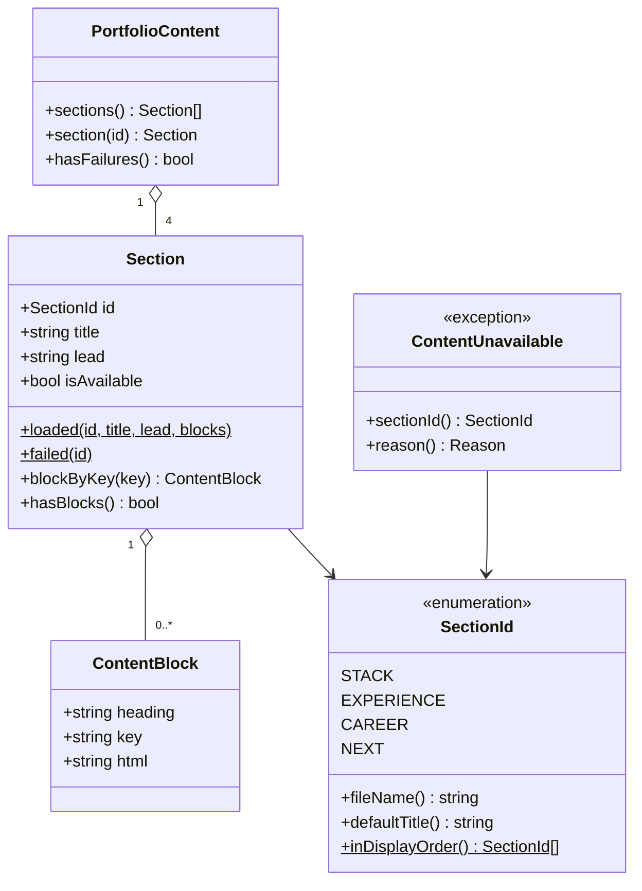

# Domain Entities — UoW-2（コンテンツ基盤）

Application Design の暫定モデルを、実データ（`content/*.md`）に合わせて確定させたもの。
技術非依存の定義。フレームワークやライブラリの都合はここに持ち込まない。

---

## 1. モデルの全体像

```
PortfolioContent
  └─ Section [4]                     表示順に並ぶ
       ├─ id      : SectionId        stack / experience / career / next
       ├─ title   : string           H1 から取得（無ければ既定値）
       ├─ lead    : string           最初の H2 より前の HTML（H1 は除く）
       ├─ blocks  : ContentBlock[]   H2 ごと。0 個でもよい
       └─ isAvailable : bool         読み込みに成功したか
                └─ ContentBlock
                     ├─ heading : string   H2 の原文（表示用）
                     ├─ key     : string   正規化済みの見出し（照合用）
                     └─ html    : string   H2 配下の HTML
```

**Application Design からの変更点**

| # | 変更 | 理由 |
|---|---|---|
| 1 | `Section` に **`lead`** を追加 | 全ファイルに H1 直後の本文があり、置き場所が無かった（Q1 = A） |
| 2 | `Section` に **`title`** を追加（H1 由来） | Q2 = C |
| 3 | `ContentBlock` に **`key`** を追加 | 見出しの表記ゆれを吸収して照合するため（Q5 = B） |
| 4 | 「`blocks` が空 = 失敗」を**撤回** | `experience.md` / `next.md` は H2 を持たない正常なファイル（Q4 = C） |

---

## 2. SectionId（値オブジェクト / enum）

掲載セクションの識別子。ファイル名・既定タイトル・表示順を一箇所に閉じ込める。

| ケース | 値 | ファイル | 既定タイトル | 表示順 |
|---|---|---|---|---|
| `STACK` | `stack` | `stack.md` | 技術構成 | 1 |
| `EXPERIENCE` | `experience` | `experience.md` | やってきたこと | 2 |
| `CAREER` | `career` | `career.md` | キャリアの変遷 | 3 |
| `NEXT` | `next` | `next.md` | これから | 4 |

**表示順は `docs/requirements.md` §5 の S-2 〜 S-5 に対応する。**
技術構成を経歴より前に置くのは、技術力が最大の訴求軸であるため（同 §5）。

**既定タイトルの位置づけ**: H1 が読めなかった場合のフォールバックのみに使う（Q2 = C）。
通常は Markdown の H1 が表示される。

**Hero（S-1）は含まない。** Markdown を持たず、React コンポーネントに直接記述する（Q1 = B / ADR 相当の決定）。

**enum に無いファイルは読まない**（Q6 = A）。`content/` に別のファイルを置いても無視される。

---

## 3. Section（エンティティ相当 / 不変）

1 セクションの内容。**読み込み成功と失敗の両方を表現できる。**

| 属性 | 型 | 内容 |
|---|---|---|
| `id` | `SectionId` | 識別子 |
| `title` | `string` | 表示用の見出し。H1 由来、無ければ `SectionId` の既定値 |
| `lead` | `string` | 最初の H2 より前の HTML。**H1 は含まない** |
| `blocks` | `ContentBlock[]` | H2 ごとのブロック。**0 個でもよい** |
| `isAvailable` | `bool` | 読み込みに成功したか |

**生成経路は 2 つだけ**

| 名前付きコンストラクタ | 用途 | `isAvailable` |
|---|---|---|
| `loaded(id, title, lead, blocks)` | 読み込み成功 | `true` |
| `failed(id)` | 読み込み失敗。`title` は既定値、`lead` は空、`blocks` は空 | `false` |

直接インスタンス化させない。`isAvailable` を外から自由に設定できると失敗表現が壊れるため。

**振る舞い**

| 操作 | 内容 |
|---|---|
| `blockByKey(key)` | 正規化済みキーでブロックを引く。無ければ「見つからない」を返す |
| `hasBlocks()` | `blocks` が 1 つ以上あるか |

**`失敗` と `中身が無い` は別物**

| 状態 | `isAvailable` | 画面表示 |
|---|---|---|
| 読み込み成功、H2 なし（`experience.md`） | `true` | `lead` の内容を表示 |
| 読み込み成功、H2 あり（`stack.md`） | `true` | `lead` + 各ブロック |
| 読み込み失敗 | `false` | 「コンテンツを読み込めませんでした」（Q6-a = A） |

---

## 4. ContentBlock（値オブジェクト / 不変）

H2 見出しと、その配下の HTML の組。

| 属性 | 型 | 内容 |
|---|---|---|
| `heading` | `string` | H2 の原文。**画面に表示するのはこちら** |
| `key` | `string` | 正規化済みの見出し。**照合に使うのはこちら**（規則は business-rules.md） |
| `html` | `string` | 次の H2（またはファイル末尾）までの HTML |

**`heading` と `key` を分ける理由**

構成図のノードと突き合わせるとき、表記ゆれで対応が切れるのを避けたい（Q5 = B）。
一方で画面には原文をそのまま出したい。役割が違うので属性を分ける。

**実データでの例**

| `heading`（原文） | `key`（正規化後） |
|---|---|
| `CloudFront` | `cloudfront` |
| `API Gateway` | `api gateway` |
| `Lambda (Bref)` | `lambda (bref)` |
| `Laravel + Inertia.js` | `laravel + inertia.js` |
| `デプロイ: osls` | `デプロイ: osls` |
| `拡張ポイント` | `拡張ポイント` |

---

## 5. PortfolioContent（集約）

ページ 1 枚分の内容。`Section` の順序付きコレクション。

| 操作 | 内容 |
|---|---|
| `section(id)` | ID でセクションを引く |
| `hasFailures()` | 失敗したセクションが 1 つでもあるか |
| `sections()` | 表示順に並んだ全セクション |

**不変条件**: `SectionId` の全ケースに対応する `Section` が必ず 1 つずつ存在する。
読み込みに失敗した場合も `failed()` で埋まるため、**要素数は常に 4。**
「セクションが消える」ことは起きない（Q6-a = A の帰結）。

---

## 6. ContentUnavailable（ドメイン例外）

セクションの内容が取得・変換できなかったことを表す。

| 属性 | 内容 |
|---|---|
| 対象 | 失敗した `SectionId` |
| 原因 | 連結された例外（ログ出力用。**画面には出さない**） |
| 理由の種別 | `FILE_MISSING` / `FILE_UNREADABLE` / `BODY_EMPTY` / `CONVERSION_FAILED` |

**メッセージにファイルの絶対パスを含めない**（NFR-S6 / SECURITY-09）。
理由の種別はログの分析用で、画面表示には使わない。

---

## 7. 関係図



**テキスト代替**

```
PortfolioContent  --(4 個を保持)--> Section
Section           --(0 個以上を保持)--> ContentBlock
Section            --(識別子として参照)--> SectionId
ContentUnavailable --(対象として参照)--> SectionId

Section は loaded() / failed() の 2 経路でのみ生成される。
PortfolioContent の Section 数は常に 4（失敗時も failed() で埋まる）。
```
