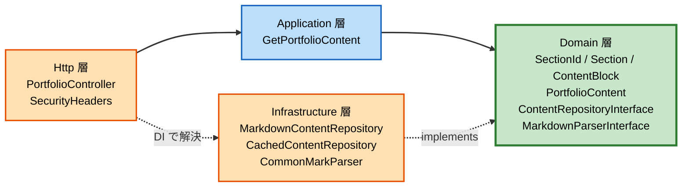
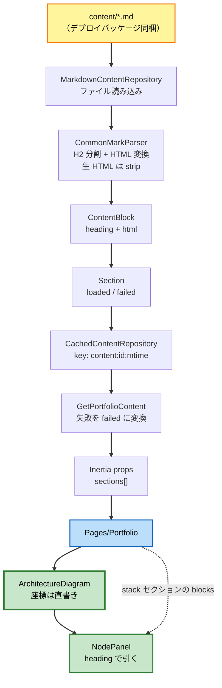

# Component Dependency

依存関係、通信パターン、データフロー。

---

## 1. 依存の向き



**テキスト代替**

```
Http 層         -> Application 層 -> Domain 層
Infrastructure 層 ...implements...> Domain 層のインターフェース
Http 層         ...DI コンテナ経由で Infrastructure の実装を注入...

Domain 層は誰にも依存しない（Laravel にも CommonMark にも依存しない）
```

**不変条件**
1. `Domain/` は `Illuminate\*` を import しない
2. `Domain/` は `League\CommonMark\*` を import しない
3. `Application/` は `Infrastructure/` を import しない（インターフェース経由のみ）
4. `Infrastructure/` は `Http/` を import しない

**検証方法**: Build and Test ステージで、上記を静的に確認する手順を用意する
（`grep` ベースの簡易チェック、または `deptrac` などの導入を検討）。

---

## 2. 依存マトリクス

行が「依存する側」、列が「依存される側」。`I` はインターフェース経由。

| ↓依存元 / 依存先→ | SectionId | Section | ContentBlock | PortfolioContent | ContentRepoI/F | MarkdownParserI/F | ContentUnavailable | Laravel | CommonMark |
|---|---|---|---|---|---|---|---|---|---|
| `PortfolioController` | ✓ | ✓ | ✓ | ✓ | | | | ✓ | |
| `GetPortfolioContent` | ✓ | ✓ | | ✓ | I | | ✓ | ログのみ | |
| `MarkdownContentRepository` | ✓ | ✓ | ✓ | | I（実装） | I | ✓ | | |
| `CachedContentRepository` | ✓ | ✓ | | | I（実装/委譲） | | ✓ | キャッシュのみ | |
| `CommonMarkParser` | | | ✓ | | | I（実装） | | | ✓ |
| `SecurityHeaders` | | | | | | | | ✓ | |
| Domain 全体 | — | — | — | — | — | — | — | **✗** | **✗** |

**読み方**: `CommonMarkParser` だけが CommonMark を知っている。
`MarkdownContentRepository` はファイルシステムを知っているが、Markdown の文法は知らない。
`GetPortfolioContent` はどちらも知らない。

---

## 3. 通信パターン

| 経路 | 方式 | 同期/非同期 | 備考 |
|---|---|---|---|
| Browser → CloudFront | HTTPS | 同期 | Lift `server-side-website`（ADR-005） |
| CloudFront → S3 | 内部（OAC） | 同期 | 静的アセットのみ。S3 は非公開（NFR-S7） |
| CloudFront → API Gateway | HTTPS | 同期 | 動的リクエスト |
| API Gateway → Lambda | AWS SDK 内部 | 同期 | HTTP API のワイルドカードルート |
| Lambda 内: Http → Application → Domain | PHP メソッド呼び出し | 同期 | プロセス内 |
| Infrastructure → ファイルシステム | `file_get_contents` | 同期 | デプロイパッケージ同梱（ADR-003） |
| Infrastructure → キャッシュ | Laravel Cache | 同期 | Lambda では `/tmp` |
| Lambda → CloudWatch Logs | stderr | 非同期 | 構造化ログ（NFR-S3） |
| Browser ↔ React | Inertia props | 同期（初回のみ） | 単一ページのため後続リクエストなし（Q4 = A） |

**プロセス外通信はデータベースも外部 API も持たない。**
Lambda 内で完結するため、リトライ・サーキットブレーカ・タイムアウト設計の対象がない
（Resiliency 拡張を無効にした根拠でもある: ADR-010）。

---

## 4. データフロー



**テキスト代替**

```
content/*.md
  -> MarkdownContentRepository（読み込み）
  -> CommonMarkParser（H2 で分割、HTML に変換、生 HTML は除去）
  -> ContentBlock（heading + html）
  -> Section（loaded または failed）
  -> CachedContentRepository（key: content:{id}:{mtime}）
  -> GetPortfolioContent（失敗を failed に変換、ログ出力）
  -> Inertia props（sections[]）
  -> Pages/Portfolio
       -> ArchitectureDiagram（ノード座標は直書き）
            -> NodePanel（選択ノードの heading で stack の blocks を引く）
```

---

## 5. 結合点とその危うさ

| 結合点 | 内容 | 壊れ方 | 緩和策 |
|---|---|---|---|
| **H2 見出し ↔ 構成図ノード** | `stack.md` の H2 テキストと `DiagramNodeDef.heading` の文字列一致（Q2 = A） | 見出しを変えるとパネルが空になる。**実行時まで気付けない** | 1) `content/stack.md` の冒頭に規約コメントを書く 2) 全ノードの `heading` が実在することを検証する Feature テストを追加する 3) 不一致時は「説明はまだありません」を表示し、画面は壊さない |
| `SectionId` ↔ ファイル名 | enum が対応を保持 | ファイル名変更で読み込み失敗 | `failed` セクションとして表示され、ログに残る |
| props の形 ↔ React の型 | サーバ側の `toProps()` とフロントの型定義 | 片方だけ変えると表示が壊れる | TypeScript 採用ならビルド時に検出（components.md の未確定事項） |
| キャッシュキー ↔ ファイル更新 | `filemtime` に依存 | mtime が変わらない更新は反映されない | デプロイのたびにファイルが展開されるため実運用では発生しない。ローカルでは `cache.enabled = false` |

**最も危ういのは 1 行目**。Q2 = A（規約による対応付け）を選んだ以上、
文字列一致の破綻を検出する手段を実装側に用意する必要がある。
Functional Design（UoW-2）と Code Generation（UoW-4）で、この検証テストを必ず含める。

---

## 6. UoW との対応

| UoW | 追加されるコンポーネント |
|---|---|
| UoW-1 | `PortfolioController`（雛形）、`SecurityHeaders`、`Pages/Portfolio`（雛形） |
| UoW-2 | Domain 一式、`GetPortfolioContent`、`MarkdownContentRepository`、`CachedContentRepository`、`CommonMarkParser`、`config/content.php` |
| UoW-3 | `components/layout/Section`、`components/content/MarkdownBlock`、`ContentUnavailable`、`Hero`、`Experience`、`Career`、`Next`、`GitHubLink` |
| UoW-4 | `ArchitectureDiagram`、`DiagramNode`、`FlowParticles`、`ExtensionPoints`、`NodePanel`、`usePrefersReducedMotion`、`Stack` |

UoW-3 と UoW-4 は UoW-2 完了後に並行可能（`docs/aidlc-inception.md` §3）。
両者が共有するのは `SectionProps` の型のみで、コンポーネントの重複はない。
