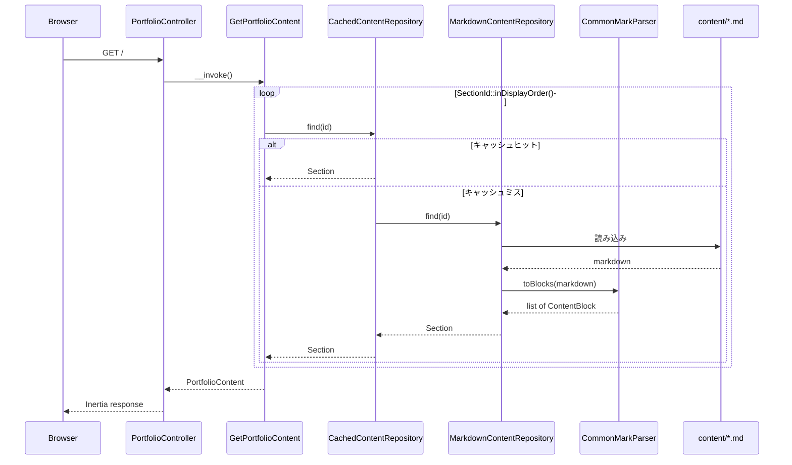
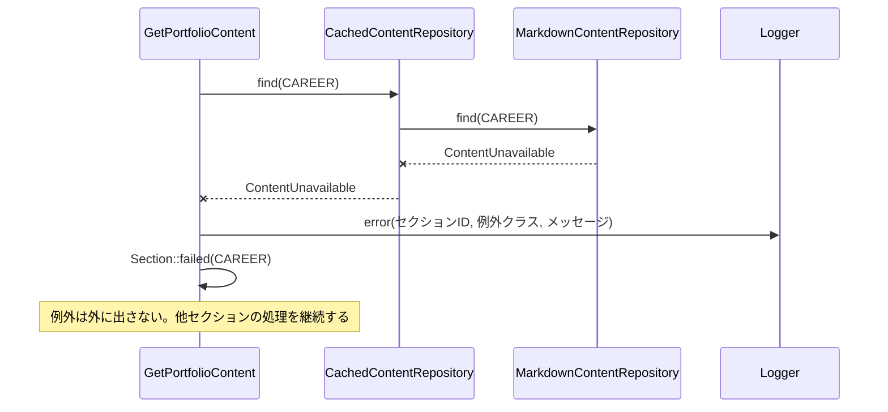

# Services

サービス定義とオーケストレーション。

**前提**: 本プロジェクトはサーバ側に業務ロジックを持たない（ADR-004）。
「サービス」と呼べる実体は、ページ 1 枚分のコンテンツを組み立てるユースケース 1 つだけ。
サービスを増やさないこと自体が設計判断である。

---

## サービス一覧

| サービス | レイヤ | 責務 | 呼び出し元 |
|---|---|---|---|
| `GetPortfolioContent` | Application | 全セクションを取得し、失敗を表示可能な状態に変換して 1 つの集約にまとめる | `PortfolioController` |

**サービスが 1 つしかない理由**: ユースケースは「ポートフォリオを表示する」のみ。
書き込み・検索・認証・通知が存在しない。UoW-3・UoW-4 が増やすのは表示層であって、
サーバ側のユースケースではない。

---

## オーケストレーション

### 通常系: `/` へのリクエスト



**テキスト代替**

```
GET /
  PortfolioController
    GetPortfolioContent
      各 SectionId について:
        CachedContentRepository.find(id)
          ヒット   -> キャッシュの Section を返す
          ミス     -> MarkdownContentRepository.find(id)
                        content/{file}.md を読む
                        CommonMarkParser.toBlocks() で H2 単位に分割
                        Section を返す -> キャッシュに格納
      PortfolioContent を返す
    props に変換
  Inertia レスポンス
```

### 異常系: セクションの読み込みに失敗



**テキスト代替**

```
CachedContentRepository.find(CAREER)
  -> MarkdownContentRepository.find(CAREER)
       ファイルが無い / 空 / パース結果が空
       -> ContentUnavailable を投げる
  -> キャッシュはしない（次回再試行できるように）
GetPortfolioContent
  -> 例外を捕捉
  -> Logger に記録（画面には出さない詳細を含む）
  -> Section::failed(CAREER) に差し替え
  -> ループを継続。他セクションは通常どおり表示される
画面
  -> Career セクションの枠は表示され、本文位置に
     「コンテンツを読み込めませんでした」を表示（Q6-a = A）
```

---

## 依存性注入（`AppServiceProvider`）

インターフェースと実装の結び付けを 1 箇所に集約する。

```php
$this->app->bind(MarkdownParserInterface::class, CommonMarkParser::class);

$this->app->bind(ContentRepositoryInterface::class, function ($app) {
    return new CachedContentRepository(
        inner: new MarkdownContentRepository(
            parser: $app->make(MarkdownParserInterface::class),
            contentPath: config('content.path'),
        ),
        cache: $app->make('cache.store'),
        contentPath: config('content.path'),
    );
});
```

**テスト時の差し替え**（ADR-009 / Feature テスト）
- `ContentRepositoryInterface` に、失敗を返すフェイク実装を束ねる →
  「1 セクションだけ失敗してもページ全体は表示される」を Feature テストで検証できる
- `CachedContentRepository` を外して素の `MarkdownContentRepository` を束ねる →
  キャッシュの影響を受けずにパース結果を検証できる

**設計上の狙い**: Q6-a = A の挙動（失敗しても壊れない）は、
実際にファイルを壊さないと確認できない類の振る舞い。ポートを切っておくことで、
テストから失敗状態を注入できるようにしている。層を増やした主な見返りはここにある。

---

## 設定（`config/content.php`）

| キー | 目的 | 既定値 |
|---|---|---|
| `path` | Markdown 配置ディレクトリ | `base_path('content')` |
| `cache.enabled` | キャッシュの有効化 | `true`（ローカルでは `false` を推奨） |
| `cache.ttl` | キャッシュ保持秒数 | Infrastructure Design で決定 |

**注意**: Lambda 上で書き込み可能なのは `/tmp` のみ。
キャッシュストアの出力先設定は Infrastructure Design（UoW-1）で確定する。
