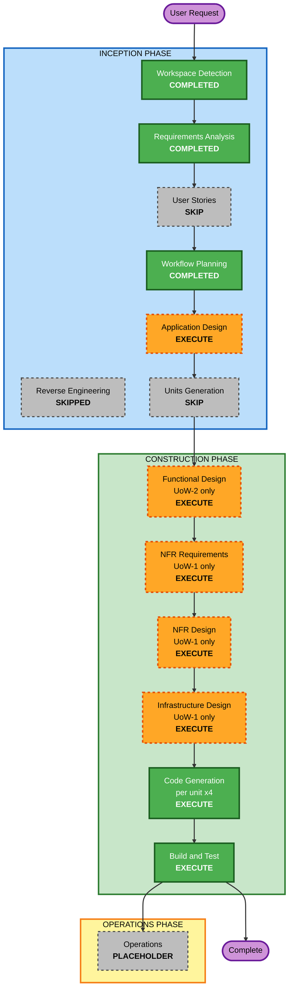

# Execution Plan

**作成日**: 2026-08-22
**対象**: portfolio2026（HK Portfolio）
**スコープ**: UoW-1 〜 UoW-4（サイト完成まで）

---

## 1. Detailed Analysis Summary

### Change Impact Assessment

| 影響領域 | 有無 | 内容 |
|---|---|---|
| **User-facing changes** | Yes | サイト全体が新規。訪問者が見る全画面が対象 |
| **Structural changes** | Yes | Laravel + Inertia + Bref + osls の構成をゼロから構築 |
| **Data model changes** | No | データベースを持たない（ADR-002）。永続化スキーマなし |
| **API changes** | No | 公開 API を持たない（ADR-004）。Inertia のページレスポンスのみ |
| **NFR impact** | Yes | NFR-1（費用）、NFR-S1〜S7（セキュリティ）が構成に直接影響 |

### Application Layer Impact
- **Code changes**: 新規プロジェクト一式（ルーティング、Markdown 読み込み、Inertia ページ、React コンポーネント）
- **Dependencies**: `laravel/framework`, `inertiajs/inertia-laravel`, `league/commonmark`, `bref/bref`, `bref/laravel-bridge`, `react`, `tailwindcss`, `pestphp/pest`
- **Configuration**: `.env`、`compose.yaml`（Sail）、`serverless.yml`（osls + Lift）、`vite.config.js`
- **Testing**: Pest によるユニット + Feature（ADR-009）

### Infrastructure Layer Impact
- **Deployment model**: AWS Lambda（Bref 3.0 / PHP 8.4）+ API Gateway HTTP API + CloudFront + S3
- **Networking**: VPC を使わない（NFR-2）。セキュリティグループ・サブネットなし
- **Storage**: S3（静的アセットのみ、パブリックアクセスブロック: NFR-S7）
- **Scaling**: Lambda の従量課金に委ねる。プロビジョンド同時実行は使わない

### Operations Layer Impact
- **Logging**: CloudFront・API Gateway のアクセスログ（NFR-S2）、Laravel の構造化ログを CloudWatch Logs へ（NFR-S3、保持 90 日以上）
- **Monitoring**: 監視ダッシュボードは作らない（Resiliency 拡張は無効: ADR-010）
- **Deployment**: `osls deploy` の手動実行。CI/CD パイプラインは今回のスコープ外

### Risk Assessment

| 項目 | 判定 |
|---|---|
| **Risk Level** | **Medium** |
| **Rollback Complexity** | Easy（Git で戻せる。AWS 側は `osls remove` でスタックごと削除可能） |
| **Testing Complexity** | Moderate |

**Medium とした理由**
- 個人サイトで、失われる本番データも既存利用者もいない（→ 本来は Low）
- 一方で、Bref + osls + Lift の組み合わせは初回構築で、ローカルで動いても Lambda 上で動かない類の問題が起きうる
- CSP を `unsafe-inline` なしで通す要件（NFR-S1）が Vite のビルド出力と衝突する可能性がある（CON-3）

---

## 2. Workflow Visualization



### Text Alternative

```
INCEPTION PHASE
  Workspace Detection ......... COMPLETED
  Reverse Engineering ......... SKIPPED  (greenfield)
  Requirements Analysis ....... COMPLETED
  User Stories ................ SKIP     (US-1..7 が既存)
  Workflow Planning ........... COMPLETED
  Application Design .......... EXECUTE
  Units Generation ............ SKIP     (UoW-1..4 が既存)

CONSTRUCTION PHASE (per-unit loop x4)
  Functional Design ........... EXECUTE  (UoW-2 のみ)
  NFR Requirements ............ EXECUTE  (UoW-1 のみ)
  NFR Design .................. EXECUTE  (UoW-1 のみ)
  Infrastructure Design ....... EXECUTE  (UoW-1 のみ)
  Code Generation ............. EXECUTE  (UoW-1, 2, 3, 4)
  Build and Test .............. EXECUTE

OPERATIONS PHASE
  Operations .................. PLACEHOLDER
```

---

## 3. Phases to Execute

### 🔵 INCEPTION PHASE
- [x] Workspace Detection (COMPLETED)
- [x] Reverse Engineering (SKIPPED)
  - **Rationale**: greenfield。解析対象の既存コードが存在しない
- [x] Requirements Analysis (COMPLETED)
- [x] User Stories — **SKIP**
  - **Rationale**: `docs/aidlc-inception.md` §2 に US-1〜7 が受け入れ条件付きで既に存在する。Q2 の回答（`docs/` を正典とし複製しない）により、同内容を `aidlc-docs/` に再生成しない
- [x] Workflow Planning (IN PROGRESS)
- [ ] Application Design — **EXECUTE**
  - **Rationale**: Markdown 読み込みの責務分担（コントローラ / サービス / パーサ）と、React コンポーネントの構成、特に `ArchitectureDiagram` が受け取るデータ構造を先に決める必要がある。ここが決まらないと UoW-2 と UoW-4 が並行できない
- [ ] Units Generation — **SKIP**
  - **Rationale**: `docs/aidlc-inception.md` §3 に UoW-1〜4 が依存関係・ストーリー対応付きで既に存在する。本ステージの成果物と同等

### 🟢 CONSTRUCTION PHASE

per-unit ループを UoW-1 → UoW-2 → UoW-3 → UoW-4 の順で回す。

- [ ] Functional Design — **EXECUTE（UoW-2 のみ）**
  - **Rationale**: Markdown → CommonMark → Inertia props の変換規則（front matter の扱い、セクション分割、`stack.md` の見出しと構成図ノードの対応付け）が本プロジェクト唯一の実質的なロジック。UoW-1 は雛形生成、UoW-3・UoW-4 は表示層のためスキップ
- [ ] NFR Requirements — **EXECUTE（UoW-1 のみ）**
  - **Rationale**: Security 拡張が有効（ADR-010）。NFR-S1〜S7 の適用先を具体化する。技術選定自体は ADR で確定済みのため、この段では選定を再検討しない
- [ ] NFR Design — **EXECUTE（UoW-1 のみ）**
  - **Rationale**: セキュリティヘッダの実装方式（ミドルウェア vs CloudFront レスポンスヘッダポリシー）、CSP と Vite の両立方式（nonce か例外か: CON-3）、ログの構造化方式を決める
- [ ] Infrastructure Design — **EXECUTE（UoW-1 のみ）**
  - **Rationale**: `serverless.yml` の構造、Lift `server-side-website` の設定、IAM 最小権限（NFR-S4）、アクセスログ（NFR-S2）、ログ保持（NFR-S3）を具体化する
- [ ] Code Generation — **EXECUTE（ALWAYS、UoW ごとに 4 回）**
  - **Rationale**: 実装が必要
- [ ] Build and Test — **EXECUTE（ALWAYS）**
  - **Rationale**: ビルド・テスト・検証手順の整備

### 🟡 OPERATIONS PHASE
- [ ] Operations — **PLACEHOLDER**
  - **Rationale**: 将来のデプロイ・監視ワークフロー用のプレースホルダ

---

## 4. Bolt 実行順序と CON-1 の扱い

`docs/aidlc-inception.md` §4 の Bolt Plan に対応する。

| Bolt | UoW | 内容 | AWS 認証情報 |
|---|---|---|---|
| B-1 | UoW-1 | Sail + Laravel + Inertia + Tailwind がローカルで起動 | 不要 |
| B-2 | UoW-1 | osls + Bref でデプロイ、CloudFront で公開 | **必要** |
| B-3 | UoW-2 | Markdown 読み込み導線 | 不要 |
| B-4 | UoW-3 | 静的セクション一式 | 不要 |
| B-5 | UoW-4 | 構成図アニメーション ★最重要 | 不要 |
| B-6 | — | 最終確認 | 必要（再デプロイ） |

### CON-1（AWS 認証情報が未設定）への対応 — 推奨: 案 A

**Bolt 順序は変更しない。** B-1 は AWS を必要としないため、**B-1 を進めている間に並行して認証情報を準備**してもらう。

推奨理由:
- B-2 を後ろに送る（案 B）と、Bref のパッケージングや Lambda 上でのみ再現する問題の発覚が最後になる。B-2 を早期に置いた本来の意図（`docs/aidlc-inception.md` §4）が失われる
- B-1 の所要時間内に `aws configure` は完了できる。順序を崩す必要がない

**B-2 到達時点で認証情報が未整備だった場合のフォールバック**: B-3 → B-4 を先に進め、認証情報が整い次第 B-2 を実行する（案 B に切り替え）。

必要な準備:
- IAM ユーザーまたは SSO プロファイル（`osls deploy` は CloudFormation・Lambda・S3・CloudFront・API Gateway・IAM の作成権限が必要）
- `aws configure`（またはプロファイル指定）
- リージョンの決定（未定。`ap-northeast-1` を想定）

---

## 5. Estimated Timeline

| 単位 | 見積り |
|---|---|
| 残 INCEPTION ステージ（Application Design） | 1 セッション |
| CONSTRUCTION 設計ステージ（FD / NFR-R / NFR-D / Infra） | 2〜3 セッション |
| UoW-1 実装（B-1, B-2） | 1 日 |
| UoW-2 実装（B-3） | 半日 |
| UoW-3 実装（B-4） | 半日 |
| UoW-4 実装（B-5）★最重要 | 1〜2 日 |
| Build and Test（B-6） | 半日 |

**B-5 に最も時間を配分する**（`docs/aidlc-inception.md` §4）。ここが訴求の中核。

---

## 6. Success Criteria

**Primary Goal**: サイトを見た人が技術構成について直接質問したくなる状態をつくる（`docs/requirements.md` §1）

**Key Deliverables**
- CloudFront のデフォルトドメインで公開されたサイト
- `content/*.md` の編集だけで内容が更新できる状態
- 構成図アニメーション（リクエストの流れ + ノード別選定理由 + 拡張ポイント）
- Pest によるユニット + Feature テスト
- `serverless.yml` によるデプロイ手順

**Quality Gates**
1. `docs/requirements.md` §7 の完了条件を全て満たす
2. NFR-S1〜S7 が実装され、各ステージの Security Compliance でブロッキング所見が無い
3. Pest のテストが全て通る
4. モバイル幅で全セクションが破綻しない
5. `prefers-reduced-motion` でアニメーションが停止し、情報が読める
